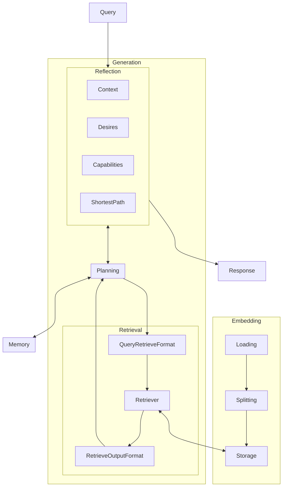

All things change, and all things in this document and its template will evolve over time. Keep records when things go unexpectedly.

## Current Intent

What's the idea? What are you currently trying to do? What are you trying to get out of the whole thing?

This is a program to input your personal musings and reference material, and have a way to reference everything you've done. Don't reinvent the wheel. Instead, ask yourself, literally, have I done this before? What did I *already* learn?

Doubles as the beginnings of a progress advisor. "How far along with my projects am I?"

Aiming to make it more of a chatbot. A personal assistant.

## Inspiration

You'll be reinventing the wheel if you don't go to the market and see what other people have already done.

- [Harry Dresden's skull, Bob](bob), from the Dresden Files series.
- Contextual understanding, visa vi [Backpack Models](backpack)

## Resources

Influence is one thing. You've got to start somewhere, hopefully a few somewheres, each of them workable. You get more results faster by refactoring rather than starting over.

- [Lilian Weng's Autonomous Agents Tutorial](llm-agents)
- [Retrieval Augmented Generation](rag)
  - [LangChain](langchain) has [a pretty good overview for RAG](lc-rag), and it seems like the open source ecosystem everyone is jumping on.

## Method

How does it actually work? Diagram or brief overview; save details for additional docs.

Copying from [the langchain overview](lc-rag)

- Loading
- Splitting
- Storage
- Retrieval
- Generation

## Goals

What is the bare minimum it takes to have a "usable" result? Without an off ramp you're investing in a new lifestyle.

First words, then lists, then diagrams. Think big and prune. Tasks are better than ideas.

- [x] Proof of Concept
  - [x] Embedding
  - [x] Similarity search (no chat is fine)
- [ ] Agent Setup
  - [ ] Selection
    - [ ] Summary (Reflection)
    - [x] Retrieval
    - [x] Interface
  - [ ] Query Formatting
    - [ ] Reflection
    - [ ] Retrieval
    - [ ] Planning
- [ ] Token Statistics
- [ ] GraphChat Interface
  - [ ] Memory Hierarchy (Working, Short, Long, and Procedural)
  - [ ] Query alteration and selection

## Plans

> Remember that *tasks* age like milk, not like wine.

Only **schedule** what is necessary. Ideas go in an "IDEAS.md" file, not the planned road-map. Once you've got goals, *then* select tasks from the pool of ideas.

1. [ ] Agent Setup: Selection: Summary (Reflection)
2. [ ] Query Formatting: Reflection
3. [ ] Query Formatting: Retrieval
4. [ ] Token Statistics
5. [ ] GraphChat Interface: Memory Hierarchy
6. [ ] GraphChat Interface: Query alteration and selection
7. [ ] Query Formatting: Planning

## Testing

How do you know how well it's going? How do you know where you left off? How do you know if you broke something that used to work fine?

You can't see everything all at once: make unit tests or you'll be in trouble when you come back after a hiatus.

- Embedding
  - Loading
  - Splitting
  - Storage
- 

## Dependencies

What technologies does this assume you have installed and how would other people find and install it?

## Layout

I just opened this folder; What is all of it? How are things laid out?

How do I build and run? How do I run unit tests or make changes? How do I file a bug report?

## References

If you need a thing go [to the source](src)!

[bob]: https://dresdenfiles.fandom.com/wiki/Bob

[llm-agents]: https://lilianweng.github.io/posts/2023-06-23-agent/
[rag]: https://arxiv.org/pdf/2005.11401.pdf
[lc-rag]: https://python.langchain.com/docs/use_cases/question_answering.html
[aws-rag](https://aws.amazon.com/blogs/machine-learning/question-answering-using-retrieval-augmented-generation-with-foundation-models-in-amazon-sagemaker-jumpstart/)

[backpack]: https://backpackmodels.science/
[langchain]: https://www.langchain.com/
[hugface]: https://huggingface.co/
[src]: www.alwayslistyoursources.com
