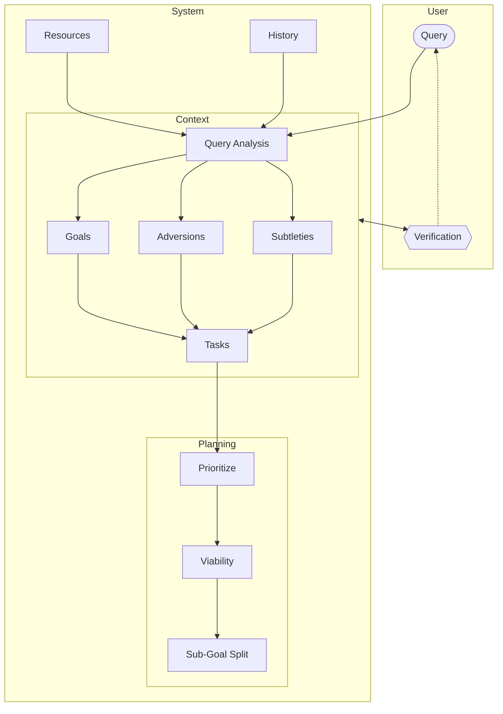

# Query Processing

```mermaid
graph TD

subgraph User
  query(["Query"])
  verification{{"Verification"}}-.->query
end

subgraph system["System"]
  resources["Resources"]
  history["History"]

  subgraph context["Context"]
    query_analysis["Query Analysis"]
    query_analysis--->goals["Goals"]
    query_analysis--->aversions["Adversions"]
    query_analysis--->subtleties["Subtleties"]

    goals--->tasks["Tasks"]
    aversions--->tasks
    subtleties--->tasks
  end
  resources--->query_analysis
  history--->query_analysis
  query--->query_analysis

  subgraph planning["Planning"]
    prioritize["Prioritize"]--->viability["Viability"]
    viability--->subgoal_split["Sub-Goal Split"]
  end
  tasks--->prioritize

end
context<--->verification

```
